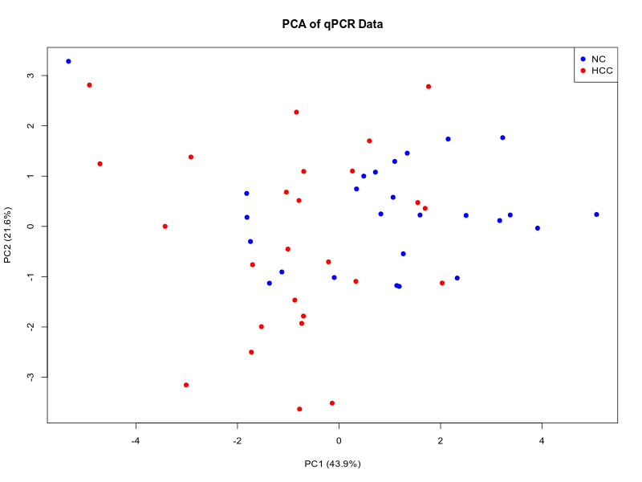
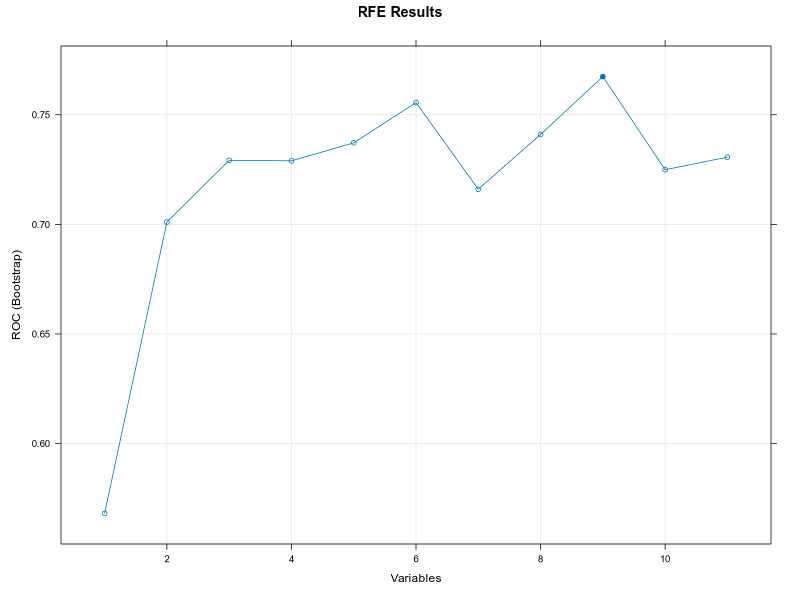
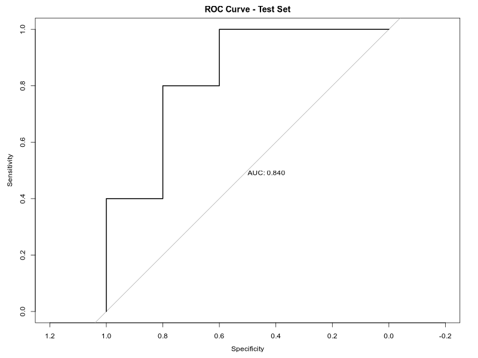

# Machine Learning with `R`
> An answer `md` file for Bioinformatics_Homework_Machine_Learning_with_R

> Direct to [T1](#t1), [T2](#t2) quickly here.
---
### T1
> Machine Learning practice with provided data

* Created [`R` script](./Scripts/script.R) for machine learning
  
    ```R
    # Library all packages
    library(glmnet)
    library(caret)
    library(pROC)
    library(mlbench)
    library(randomForest)

    # Pre-processing of data
    data <- read.csv("qPCR_data.csv", header = TRUE)
    y <- data[,13]
    x <- data[,2:12]
    x <- apply(x, 2, as.numeric)
    feature.mean <- colMeans(x, na.rm = TRUE)

    x[is.na(x)] <- matrix(
        rep(feature.mean, each = length(y)),
        nrow = length(y)
    )[is.na(x)]
    x <- scale(x, center = TRUE, scale = TRUE)

    # PCA plotting
    pca.res <- prcomp(x, center = TRUE, scale. = TRUE)
    pca.data <- as.data.frame(pca.res$x[,1:2])
    pca.data$Group <- y

    png("PCA.plot.png", width = 800, height = 600)
    plot(
        pca.data$PC1, pca.data$PC2,
        col = ifelse(pca.data$Group == "NC", "blue", "red"),
        pch = 19,
        xlab = paste0("PC1 (", round(summary(pca.res)$importance[2,1]*100, 1), "%)"),
        ylab = paste0("PC2 (", round(summary(pca.res)$importance[2,2]*100, 1), "%)"),
        main = "PCA of qPCR Data"
    )
    legend("topright", legend = c("NC", "HCC"), col = c("blue", "red"), pch = 19)
    dev.off()

    # Training/evaluation data separation
    set.seed(666)

    train.indices <- createDataPartition(
        y, p = 0.8, times = 1, list = TRUE
    )$Resample1

    x.train <- x[train.indices,]
    x.test <- x[-train.indices,]

    y.train <- factor(y.train, levels = c("NC", "HCC"))
    y.test <- factor(y.test, levels = c("NC", "HCC"))

    # Recursive feature elimination
    rfFuncs$summary <- twoClassSummary
    rfeCtrl <- rfeControl(
        functions = rfFuncs,
        verbose = TRUE,
        method = "boot",
        number = 10
    )
    rfeRes <- rfe(
        x.train,
        y.train,
        sizes = 1:11,
        rfeControl = rfeCtrl,
        metric = "ROC"
    )

    selected.features <- predictors(rfeRes)

    # RFE plotting
    png("RFE_feature_selection.png", width = 800, height = 600)
    plot(rfeRes, type = c("g", "o"), main = "RFE Results")
    dev.off()

    # Parameter tuning
    params.grid <- expand.grid(
        alpha = c(0, 0.5, 1),
        lambda = c(0.001, 0.01, 0.1, 1)
    )
    tr.ctrl <- trainControl(
        method = "cv",
        number = 5,
        summaryFunction = twoClassSummary,
        classProbs = TRUE
    )
    cv.fitted <- train(
        x.train[,selected.features],
        y.train,
        method = "glmnet",
        family = "binomial",
        metric = "ROC",
        tuneGrid = params.grid,
        preProcess = NULL,
        trControl = tr.ctrl
    )

    # Evaluation
    y.test.prob <- predict(
        cv.fitted,
        newdata = x.test,
        type = "prob"
    )
    roc.curve <- roc(y.test, y.test.prob[,2])

    # ROC plotting
    png("ROC_curve.png", width = 800, height = 600)
    plot(roc.curve, print.auc = TRUE, main = "ROC Curve - Test Set")
    dev.off()
    ```
* Acquired results
  * PCA Plot
    
  * RFE Feature Selection
    
  * ROC Curve
    

---
### T2
> Q1: Is the number of trees a hyperparameter? Why?
* **No.**
* Because adding more trees never causes overfitting. The generalization error decreases monotonically and converges. True hyperparameters (like `mtry`) have optimal values; tree count only has a computational trade-off.

> Q2: What is OOB error and its relationship with bootstrapping?
* **Bootstrapping** = Sampling N samples with replacement from N original samples.
* **OOB error** = For each sample, predict using only trees that did NOT see it during training (i.e., trees where this sample was OOB). Then calculate error rate.
* **Relationship:** OOB samples are the byproduct of bootstrapping. OOB error uses these samples as a free internal validation set, eliminating the need for separate cross-validation.
---