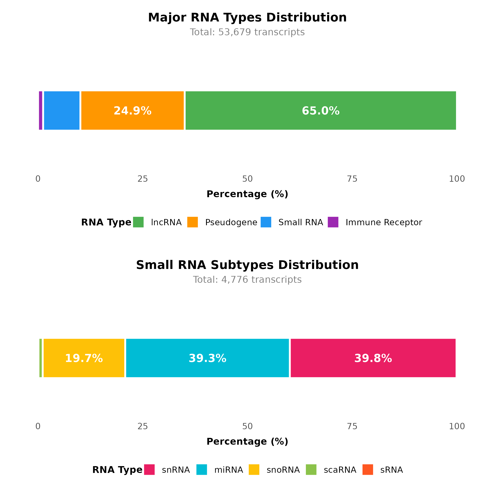

# Genome Annotation
> An answer `md` file for Bioinformatics_Homework_Genome_Annotation

> Direct to [T1](#t1) or [T2](#t2) quickly here.
---
### T1
> The size and composition of human genome

#### 1. The size of human genome
##### 1.1 Overall size
* `3,099,734,149` bp, or roughly `3.1` Gb
  * Last updated on **2025.09**
  * According to genome assembly [**`GRCh38.p14`** on NCBI](https://www.ncbi.nlm.nih.gov/datasets/genome/GCF_000001405.40/)
##### 1.2 Other statistics
* Assembly unit lengths

    | Assembly type | Length | Demonstration |
    | :---: | :---: | :--- |
    | **Chromosomes** | **`3,088,269,830` bp, `3.09` Gb** | **All chromosomes** |
    | — Autosomes | `2,875,001,520` bp, `2.88` Gb | `22` autosomes |
    | — X chromosome | `156,040,895` bp, `156.04` Mb | - |
    | — Y chromosome | `57,227,415` bp, `57.23` Mb | - |
    | **Mitochondria** | **`16,569` bp, `16.57` kb** | **Mitochondrial genome** |
    | **Other** | **`177,115,660` bp, `177.12` Mb** | Including **unlocalized scaffold**, **unplaced scaffold**, **fix patch**, **novel patch**, **alt scaffold** |
    * Last updated on **2025.09**
    * According to **[assembly report](https://ftp.ncbi.nlm.nih.gov/genomes/all/GCF/000/001/405/GCF_000001405.40_GRCh38.p14/GCF_000001405.40_GRCh38.p14_assembly_report.txt)** of genome assembly [**`GRCh38.p14`**](https://www.ncbi.nlm.nih.gov/datasets/genome/GCF_000001405.40/)
* Data visualized via `R`

    * View [script](./Appendix/size/human_genome_plot.R) or [`png` file](./Appendix/size/human_genome_plot.png)

#### 2. The basic composition of human genome
* For comprehensive classification, please direct to [T1.1.2](#12-other-statistics)
* Within chromosomal sequences, here is the basic composition
  > Data collected via `bash` script
  > View [`bash` script](./Appendix/size/annotation.sh) or [output `csv` file](./Appendix/size/annotation.csv)

  ```bash
  $ bash annotation.sh \
  > GCF_000001405.40-RS_2025_08_annotation_report.xml > \
  > annotation.csv
  ```

  * Genes

    | Gene type | Count | Length in bp |
    | :---: | :---: | :---: |
    Protein-coding genes | 19,890 | 844,688,520
    Non-coding RNA genes | 21,872 | 928,860,096
    Pseudogenes | 16,950 | 719,832,600

    * **Protein-coding genes** encode mRNAs that translate into proteins
    * **Non-coding RNA genes** encode ncRNAs that carry a variety of functions
    * **Pseudogenes** are duplicates of protein-coding genes that are no longer effective

  * RNA transcripts
  
    | Transcript type | Count | Total length in bp |
    | :---: | :---: | :---: |
    | lncRNA transcripts | 30,320 | 68,737,562 |
    miRNA transcripts | 2,875 | 62,187
    misc_RNA transcripts | 11,863 | 42,289,816
    rRNA transcripts | 37 | 104,213
    snRNA transcripts | 154 | 19,413
    snoRNA transcripts | 1,194 | 132,662
    tRNA transcripts | 431 | 31,882
    mRNA transcripts | 131,239 | 577,731,139

  * Data visualized via `R`

    * View [**script**](./Appendix/size/genome_annotation_stacked.R) or [**`png` file**](./Appendix/size/genome_annotation_stacked.png)


* Last updated on **2025.09**
* According to **[annotation report](https://ftp.ncbi.nlm.nih.gov/genomes/all/GCF/000/001/405/GCF_000001405.40_GRCh38.p14/GCF_000001405.40-RS_2025_08_annotation_report.xml)** of genome assembly [**`GRCh38.p14`**](https://www.ncbi.nlm.nih.gov/datasets/genome/GCF_000001405.40/)
---
### T2
#### 1. Lastest classification of ncRNAs
* Latest annotation on ncRNA genes
  * Count: `21872`; Length: `928860096` bp, or roughly `0.93` Gb
  * Direct to [T1.2](#2-the-basic-composition-of-human-genome) for quick heads-up
* Classification system
  ```mermaid
  mindmap
    root((ncRNA))
      ((lncRNA
      > 200 nt))
        (lincRNA
        intergenic)
          Intergenic regions between protein-coding genes
        (Antisense lncRNA)
          Overlaps a protein-coding gene on the antisense strand
        (Intronic lncRNA)
          Derived from introns
        (Bidirectional lncRNA)
          Shares promoter with adjacent protein-coding gene but transcribed oppositely
        (eRNA
        enhanced)
          Transcribed from enhancers
      ((Small ncRNA
      < 200 nt))
        (miRNA
        micro, ~ 22 nt)
          Regulates gene expression
        (siRNA
        interfering, ~ 21 nt)
          Mediates RNA interference
        (piRNA
        piwi-interacting, ~ 30 nt)
          Silences transposons in germline cells
        (snRNA
        nuclear, 100 ~ 300 nt)
          Spliceosome
        (snoRNA
        nucleolar, 60 ~ 300 nt)
          rRNA chemical modifications
        (tRNA
        transfer, 70 ~ 90 nt)
          Protein synthesis
        (rRNA
        ribosomal, 120 ~ 5000 nt)
          Ribosomes
        (scaRNA
        small Cajal body, 60 ~ 300 nt)
          Modification of snRNAs
      ((circRNA
      circular))
        miRNA sponge or translation template
      ((Pseudogene))
        (Processed pseudogene)
        (Unprocessed pseudogene)
        (Unitary pseudogene)
      ((Immune
      receptor
      genes))
        (IG
        immunoglobulin)
        (TR
        T cell receptor)
  ```
* Counts of each type/subtype
  > Data collected via the following command
  > For more detailed statistics, view [output `csv` file](./Appendix/ncRNA/ncRNA_counts.csv) here
  > The count is confined to only ncRNA genes instead of transcripts

  ```bash
  $ awk '$3 == "gene" {print $12}' \
  > gencode.v49.basic.annotation.gtf | \
  > cut -d'"' -f2 | sort | uniq -c | sort -rn | \
  > grep -v "protein_coding" | awk '{print $2 "," $1}' > \
  > ncRNA_counts.csv
  ```

  | Main type | Counts |
  | :---: | :---: |
  | lncRNA | 34,880 |
  | small RNA | 4,932 |
  | pseudogene | 13,374 |
  | immune receptor gene | 338 |
  * Data visualized via `R`

    * View [**script**](./Appendix/ncRNA/RNA_combined_distribution.R) or [**`png` file**](./Appendix/ncRNA/RNA_combined_distribution.png)

  * Last updated on **2025.09**
  * According to **[basic annotation report](https://ftp.ebi.ac.uk/pub/databases/gencode/Gencode_human/release_49/gencode.v49.basic.annotation.gtf.gz)** of genome assembly [**`GRCh38.p14`**](https://www.ncbi.nlm.nih.gov/datasets/genome/GCF_000001405.40/)
#### 2. Annotation on main ncRNAs
* Direct to [T2.1](#1-lastest-classification-of-ncrnas) for more comprehensive annotation
* Detailed annotation on main ncRNAs
  * 1. **lncRNA**
    * Long, > 200 nt
    * Contains different subtypes and carries out various functions
      * X chromosome inactivation
      * Genomic imprinting
      * Transcriptional regulation
  * 2. **rRNA**
    * Ribosomal RNA, core component of ribosome
    * mRNA decoding, protein synthesis
  * 3. **tRNA**
    * Transfer RNA adaptors for protein synthesis
  * 4. **snRNA**
    * Small nuclear RNA
      * U1, U2, U4, U5, U6
    * Spliceosome components for pre-mRNA splicing
  * 5. **snoRNA**
    * Small nucleolar RNA
    * Guides `2'-O-methylation` and `pseudouridylation` of rRNA and snRNA
  * 6. **miRNA**
    * MicroRNA, ~ 22 nt
    * Post-transcriptional gene silencing
      * RISC complex
  * 7. **Immune receptor genes**
    * **IG**
      * Immunoglobulin `V(D)J` recombination, generates antibody diversity
    * **TR**
      * T-cell receptor diversity, antigen recognition
  * 8. **Ribozyme**
    * Catalytic RNA enzymes
---