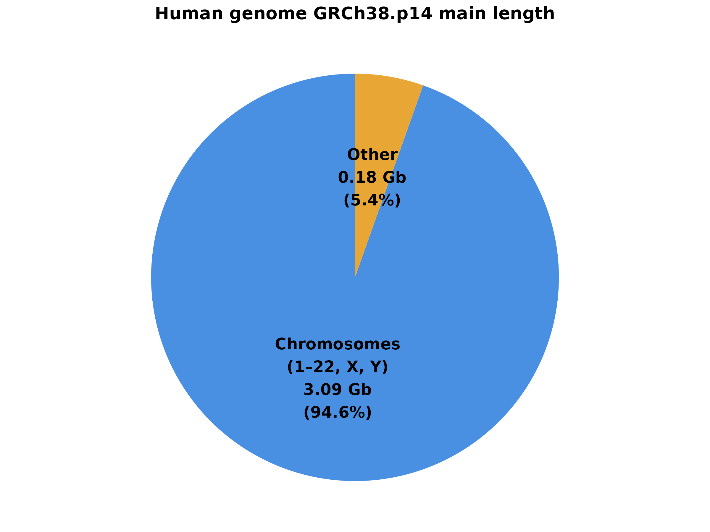

# Genome Annotation
> An answer `md` file for Bioinformatics_Homework_Genome_Annotation

> Direct to [T1](#t1) or [T2](#t2) quickly here.
---
### T1
> The size and composition of human genome

#### 1. The size of human genome
##### 1.1 Overall size
* `3,099,734,149` bp, or roughly `3.1` Gb
  * Last updated on **Feb 3, 2022**
  * According to genome assembly [**`GRCh38.p14`** on NCBI](https://www.ncbi.nlm.nih.gov/datasets/genome/GCF_000001405.40/)
##### 1.2 Other statistics
* Assembly unit lengths

    | Assembly type | Length | Demonstration |
    | :---: | :---: | :--- |
    | **Chromosomes** | **`3,088,269,830` bp, `3.09` Gb** | **All chromosomes** |
    | — Autosomes | `2,875,001,520` bp, `2.88` Gb | `22` autosomes |
    | — X chromosome | `156,040,895` bp, `156.04` Mb | - |
    | — Y chromosome | `57,227,415` bp, `57.23` Mb | - |
    | **Mitochondria** | **`16,569` bp, `16.57` kb** | **Mitochondrial genome** |
    | **Other** | **`177,115,660` bp, `177.12` Mb** | Including **unlocalized scaffold**, **unplaced scaffold**, **fix patch**, **novel patch**, **alt scaffold** |
    * Last updated on **Feb 3, 2022**
    * According to **[assembly report](https://ftp.ncbi.nlm.nih.gov/genomes/all/GCF/000/001/405/GCF_000001405.40_GRCh38.p14/GCF_000001405.40_GRCh38.p14_assembly_report.txt)** of genome assembly [**`GRCh38.p14`**](https://www.ncbi.nlm.nih.gov/datasets/genome/GCF_000001405.40/)
* Data visualized via `R`

    * View [script](./Appendix/size/human_genome_plot.R) or [`png` file](./Appendix/size/human_genome_plot.png)

#### 2. The basic composition of human genome
* For comprehensive classification, please direct to [1.2](#12-other-statistics)
* Within chromosomal sequences, here is the basic composition
  * Genes

| Gene type | Length, Percentage | Demonstration |
| :---: | :---: | :--- |
| 

    * Last updated on **Feb 3, 2022**
    * According to **[annotation report](https://ftp.ncbi.nlm.nih.gov/genomes/all/GCF/000/001/405/GCF_000001405.40_GRCh38.p14/GCF_000001405.40-RS_2025_08_annotation_report.xml)** of genome assembly [**`GRCh38.p14`**](https://www.ncbi.nlm.nih.gov/datasets/genome/GCF_000001405.40/)
---
### T2

