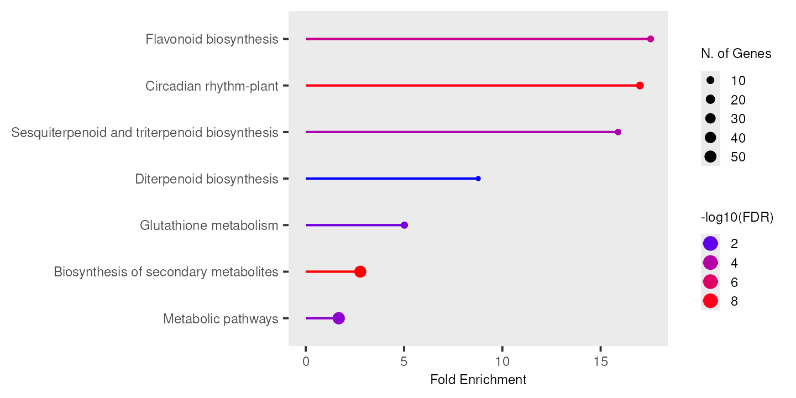

# KEGG
> An answer `md` file for Bioinformatics_Homework_Function_Analysis_KEGG

> Direct to [`KEGG` analysis](#run-kegg-analysis), [comparison](#comparison-between-kegg-and-go-results) quickly here.
---
### Run `KEGG` analysis
> Since the provided [`DAVID`](https://david.ncifcrf.gov/) website was down, I used [`WebGestalt`](https://www.webgestalt.org/) for `KEGG` analysis
* Run `KEGG` analysis and acquired result
  * Visualized graphic summary

  * Check results in [`csv`](./Results/enrichment.csv), [enrichment chart](./Results/KEGG.enrichment.chart.png) or [KEGG graph](./Results/KEGG.KEGG.graph.png)
* Main pathways

    | Pathways | Input | Pathway Genes | Fold Enrichment | FDR |
    |----------|-------|---------------|-----------------|-----|
    | **Flavonoid biosynthesis** | 6 | 25 | 17.5 | 1.7E-05 |
    | Circadian rhythm-plant | 10 | 43 | 17 | 7.6E-09 |
    | Sesquiterpenoid and triterpenoid biosynthesis | 5 | 23 | 15.9 | 1.9E-04 |
    | Diterpenoid biosynthesis | 3 | 25 | 8.8 | 3.9E-02 |
    | Glutathione metabolism | 7 | 102 | 5 | 5.0E-03 |
    | Biosynthesis of secondary metabolites | 50 | 1318 | 2.8 | 4.3E-09 |
    | Metabolic pathways | 54 | 2354 | 1.7 | 1.4E-03 |
---
### Comparison between `KEGG` and `GO` results
> View [`GO` results](../GO/T1/GO.raw.analysis.txt) here
* Shared findings

  | Biological topic | `KEGG` analysis | `GO` analysis |
  | :--- | :--- | :--- |
  | Flavonoid metabolism | Flavonoid biosynthesis | Positive regulation of flavonol biosynthetic process |
  | Terpene metabolism | Sesquiterpenoid and triterpenoid biosynthesis; Diterpenoid biosynthesis; Biosynthesis of secondary metabolites | Monoterprnoid biosynthetic process |
  | Light response | Circadian rhythm | Cellular response to UV-A; Photoreactive repair |
* Differences

  | Levels | `KEGG` analysis | `GO` analysis
  | :--- | :--- | :--- |
  | Levels of analysis | Complete pathways (bigger picture) | Particular regulation events (finer details) |
  | Enrichment | Weak | Strong |
  | Distinctive discoveries | Glutathione metabolism (suggests upregulation of antioxidation pathways) | Regulation of carbohydrate utilization; Chloroplast elongation |
* Summary
  * Key features of [gene set](../GO/T1/gennames.txt)
    * Secondary metabolism upregulation
    * Light response abnormalities
  * `GO` and `KEGG` properties
    * `GO` for specific processes
    * `KEGG` for broader pathways
---