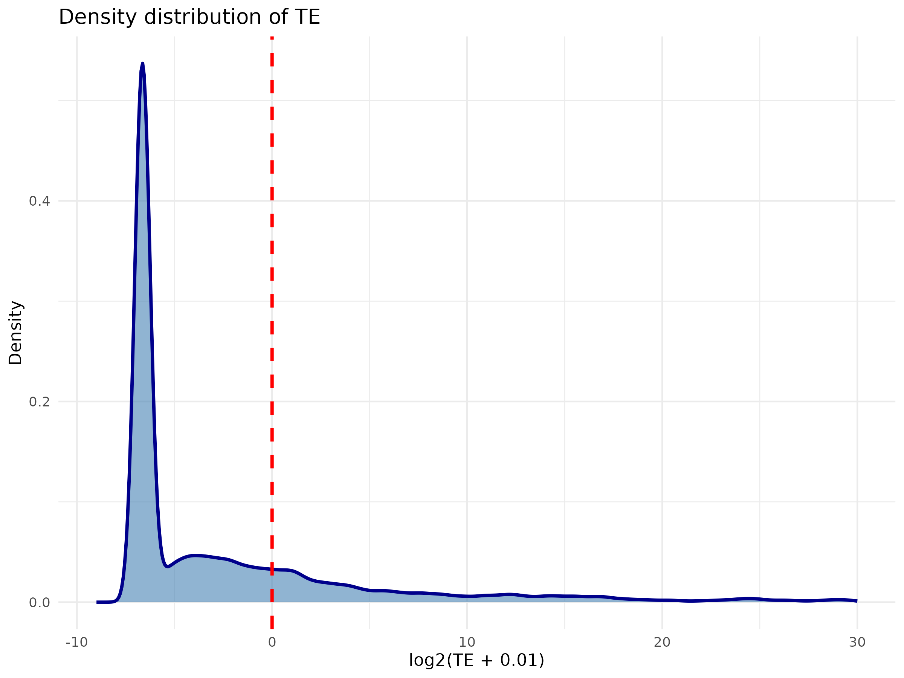
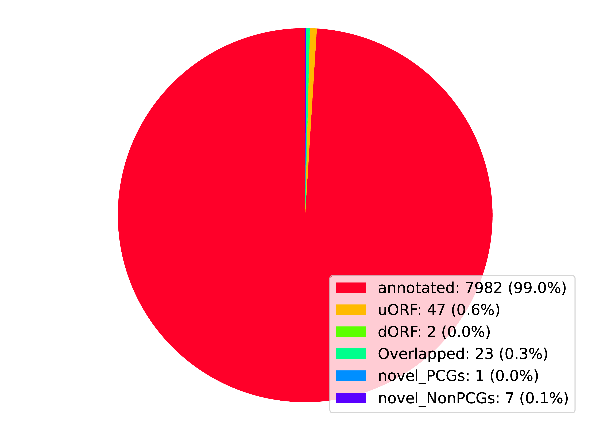
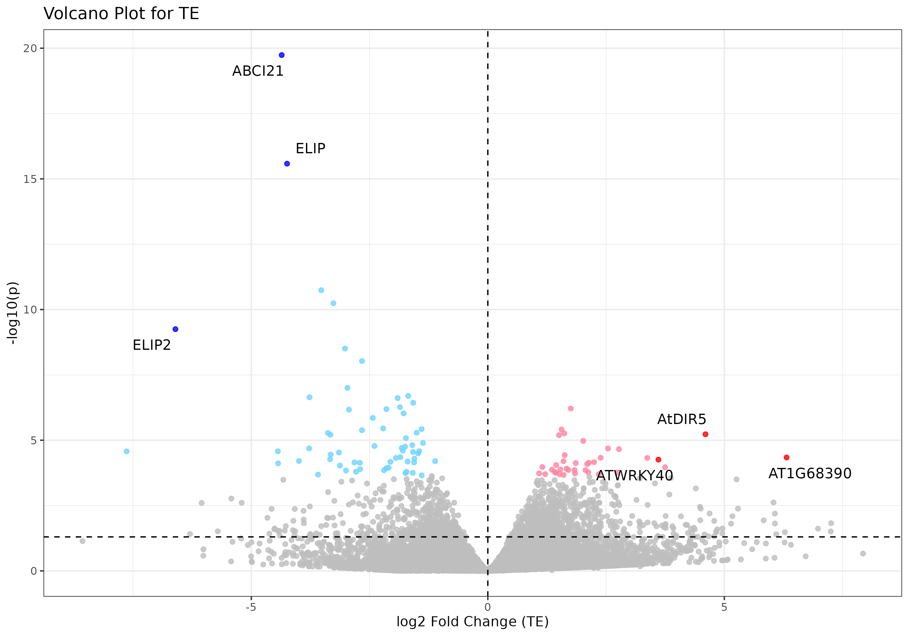

# Ribo-seq
> An answer `md` file for Bioinformatics_Homework_RNA_regulation_Ribo-seq

> Direct to [T1](#t1), [T2](#t2), [T3](#t3), [T4](#t4) quickly here.
---
### T1
> TE explained

* TE, **Translation Efficiency**
* Formula

    $$
    \text{TE} = \frac{\text{RPKM(RPF)}}{\text{RPKM(mRNA)}}
    $$

* Is the relative proportion of translated RNA fragments in all mRNAs
* `TE > 1` means high translation efficiency for the mRNA, and *vice versa*
* Implication on post-transcriptional regulation
---
### T2
> TE calculation and distribution by `RiboWave`
##### 2.1 **TE calculation**
* Load from file and run docker container
  * same step required in [T3](#t3)
  * Run in `Terminal`

    ```powershell
    PS> docker load -i ~/Desktop/bioinfo_tsinghua_6.2_apa_6.3_ribo_6.4_structure.tar.gz
    # Returns
    Loaded image: xfliu1995/bioinfo_tsinghua_6.2_apa_6.3_ribo_6.4_structure:v1

    PS> docker run --name=rnaregulation `
    >> -dt -h bioinfo_docker --restart unless-stopped `
    >> -v ~/Desktop/Bioinfo_THU/share_docker:/home/test/share `
    >> xfliu1995/bioinfo_tsinghua_6.2_apa_6.3_ribo_6.4_structure:v1
    # Returns
    10e225b9affd29aa5952f119f8146000493b86e5bf3a80290a0aad468d99249c

    PS> docker exec -u root -it rnaregulation bash
    ```
* Go to working dir
  ```bash
  cd /home/test/rna_regulation/ribo-wave
  ```
* Create [`bash` script](./T2.RiboWave/Script/scr.sh)

    ```bash
    mkdir -p /home/test/rna_regulation/ribo-wave/GSE52799/Ribowave

    # RPKM file
    RPKM="GSE52799/mRNA/SRR1039761.RPKM"

    read -t 60 -p "Do you want to use filtered mRNA RPKM data? [y/n]: " answer
    if [[ ${answer,,} == "y" ]]; then
            # Filter
            awk '$2 > 0{print $0}' "${RPKM}" > GSE52799/mRNA/SRR1039761.filtered.RPKM
            filtered="GSE52799/mRNA/SRR1039761.RPKM"

            # Run Ribowave
            script/Ribowave \
            -T 9012445  "${filtered}" \
            -a GSE52799/bedgraph/SRR1039770/final.psite \
            -b annotation_fly/final.ORFs \
            -o GSE52799/Ribowave \
            -n SRR1039770.filtered \
            -s script \
            -p 8
    elif [[ ${answer,,} == "n" ]]; then
            # Run Ribowave
            script/Ribowave \
            -T 9012445  "${RPKM}" \
            -a GSE2799/bedgraph/SRR1039770/final.psite \
            -b annotation_fly/final.ORFs \
            -o GSE52799/Ribowave \
            -n SRR1039770 \
            -s script \
            -p 8
    else
            echo "Exiting now."
    fi
    ```
* Run [script](./T2.RiboWave/Script/scr.sh)

    ```bash
    chmod 775 scr.sh
    ./scr.sh
    ```
* Check [unfiltered result](./T2.RiboWave/Results/SRR1039770.TE) or [filtered result](./T2.RiboWave/Results/SRR1039770.filtered.TE)
##### 2.2 **TE distribution visualized via `R`**
* Create [`R` script](./T2.RiboWave/Script/scr.R) for density plotting

    ```R
    library(ggplot2)

    # Extract raw TE data
    te.tab <- read.table("SRR1039770.TE",
        header = TRUE, sep = "\t", stringsAsFactors = FALSE)
    te.tab.f <- read.table("SRR1039770.filtered.TE",
        header = TRUE, sep = "\t", stringsAsFactors = FALSE)

    # Filter
    te.tab <- te.tab[
        !is.na(te.tab$TE) & !is.infinite(te.tab$TE) & !te.tab$TE == 0,
    ]
    te.tab.f <- te.tab.f[
        !is.na(te.tab.f$TE) & !is.infinite(te.tab.f$TE) & !te.tab.f$TE == 0,
    ]

    # Plot with ggplot2
    ggplot(te.tab, aes(x = log2(TE))) +
    geom_density(fill = "steelblue", alpha = 0.6, color = "darkblue", linewidth = 1) +
    geom_vline(xintercept = log2(1), color = "yellow", linewidth = 0.5) +
    xlim(-9, 100) +
    labs(title = "Density distribution of TE",
        x = "log2(TE)",
        y = "Density") +
    theme_minimal()

    ggsave("TE_density.png", width = 8, height = 6, dpi = 300)

    ggplot(te.tab.f, aes(x = log2(TE))) +
    geom_density(fill = "steelblue", alpha = 0.6, color = "darkblue", linewidth = 1) +
    geom_vline(xintercept = log2(1), color = "yellow", linewidth = 0.5) +
    xlim(-9, 100) +
    labs(title = "Density distribution of TE (filtered)",
        x = "log2(TE)",
        y = "Density") +
    theme_minimal()

    ggsave("TE_density.filtered.png", width = 8, height = 6, dpi = 300)
    ```
* Check result in `png`, [unfiltered](./T2.RiboWave/Results/TE_density.png) or [filtered](./T2.RiboWave/Results/TE_density.filtered.png)

    * Main peak at approximately -2
    * Indicates that most TE values are clustered around 0.25

* The 2 plots are in fact identical, because trimming all `RPKM=0` rows in mRNA RPKM file is equivalent with trimming all `Inf` values in `TE` files; yet the RPKM threshold is user-defined, and that might be of significance in practice.

    ```bash
    $ diff GSE52799/Ribowave/SRR1039770.TE GSE52799/Ribowave/SRR1039770.filtered.TE | \
    > awk '{print $4}' | sort | uniq -c
    # Returns
        562
    13563 Inf
    ```
---
### T3
> Use `RiboCode` for P-site and ORF prediction
##### 3.1 **P-site**
* Enter container, create [`bash` script](./T3.RiboCode/Script/scr.P-site.sh) and run

    ```bash
    RiboCode_annot=/home/test/rna_regulation/ribo-code/RiboCode_annot
    OUT=/home/test/rna_regulation/ribo-code/wtuvb2/
    mkdir -p ${OUT}
    mkdir -p ${OUT}/metaplots

    /home/test/software/miniconda3/bin/metaplots -a ${RiboCode_annot} \
    -r /home/test/rna_regulation/ribo-code/wtuvb2/wtuvb2.Aligned.toTranscriptome.out.sorted.bam \
    -o ${OUT}/metaplots/wtuvb2. \
    -m 26 -M 50 -s yes -pv1 1 -pv2 1
    ```
* Acquire result in [`pdf`](./T3.RiboCode/Results/P-site/wtuvb2.wtuvb2.Aligned.toTranscriptome.out.sorted.pdf), [`jpeg`](./T3.RiboCode/Results/P-site/wtuvb2.wtuvb2.Aligned.toTranscriptome.out.sorted.jpeg) and [`txt`](./T3.RiboCode/Results/P-site/wtuvb2._pre_config.txt)

##### 3.2 **ORF count**
* Create [`bash` script](./T3.RiboCode/Script/scr.ORF-count.sh) and run

    ```bash
    RiboCode_annot=/home/test/rna_regulation/ribo-code/RiboCode_annot
    OUT=/home/test/rna_regulation/ribo-code/wtuvb2/
    config=${OUT}/metaplots/wtuvb2._pre_config.txt
    mkdir -p ${OUT}/ORF_count
    /home/test/software/miniconda3/bin/ORFcount -g ${OUT}/ORF/ORF.gtf \
    -r ${OUT}/wtuvb2.Aligned.sortedByCoord.out.bam \
    -f 15 -l 5 -e 100 -m 24 -M 35 -s yes \
    -o ${OUT}/ORF_count/data_all.txt
    ```
* View results here
  * Folder tree
    [ORF-count](./T3.RiboCode/Results/ORF-count/)
    ├── [ORF_collapsed.gtf](./T3.RiboCode/Results/ORF-count/ORF_collapsed.gtf)
    ├── [ORF_collapsed.txt](./T3.RiboCode/Results/ORF-count/ORF_collapsed.txt)
    ├── [ORF_ORFs_category.pdf](./T3.RiboCode/Results/ORF-count/ORF_ORFs_category.pdf)
    ├── [ORF_ORFs_category.png](./T3.RiboCode/Results/ORF-count/ORF_ORFs_category.png)
    ├── [ORF.gtf](./T3.RiboCode/Results/ORF-count/ORF.gtf)
    └── [ORF.txt](./T3.RiboCode/Results/ORF-count/ORF.txt)
  * [Graphic summary](./T3.RiboCode/Results/ORF-count/ORF_ORFs_category.png)
  
* Statistics (according to [`pdf` file](./T3.RiboCode/Results/ORF-count/ORF_ORFs_category.pdf)) and ORF type explanation

    | ORF type | Count | Percentage (%) | Full name | Explanation |
    | :--- | :---: | :---: | :--- | :---
    | annotated | 7982 | 99.0 | - | Known main ORF in protein-coding genes, annotated in genome; long, with complete start/end codons. |
    | uORF | 47 | 0.6 | upstream ORF | Small ORFs located at the upstream (5'-UTR) of main ORFs; short, for translation regulation. |
    | Overlapped | 23 | 0.3 | - | Open ORFs with overlapping sequences with main ORFs or other known ORFs; increase translation capacity, participate in translation regulation. |
    | novel_NonPCGs | 7 | 0.1 | novel non-protein-coding genes | Novel ORFs discovered in regions annotated as non-protein-coding genes; short, might encode small peptides. |
    | dORF | 2 | 0.0 | downstream ORF | Small ORFs located at the downstream (3'-UTR) of main ORFs; short, for translation regulation. |
    | novel_PCGs | 7 | 0.1 | novel protein-coding genes | Novel ORFs discovered in regions annotated as protein-coding genes. |
---
### T4
> Differential TE calculation and plotting via `Xtail` in `R`
##### 4.1 **Preparation**
> Due to many version compatibility issues and outdated package resources, I pulled an existing docker image for `xtail`
* Pull image

    ```powershell
    PS> docker pull yanglab/xtail
    # Returns
    Using default tag: latest
    latest: Pulling from yanglab/xtail
    52d0acf1b567: Pull complete
    23427ac613ac: Pull complete
    a53b6144c81d: Pull complete
    badc1fe0e63e: Pull complete
    0ec668fb1856: Pull complete
    486f1beec545: Pull complete
    877fbe938c96: Pull complete
    cf0dcb951368: Pull complete
    Digest: sha256:adbb40307557c7c678b505d80700f8932c9ae727a3a81873d98b72852ef88690
    Status: Downloaded newer image for yanglab/xtail:latest
    docker.io/yanglab/xtail:latest
    ```
* Run container

    ```powershell
    PS> docker run -it --rm `
    >> -v ~/Desktop/Bioinfo_THU/share_docker:/data yanglab/xtail
    ```
##### 4.2 **Create [`R` script](./T4.Xtail/Script/scr.R)**

```R
library(xtail)
library(org.At.tair.db)
library(ggplot2)
library(ggrepel)

# Extract raw data
ribo <- read.table('Ribo_count_2.txt',
    header = TRUE, quote = '', sep = '\t', row.names = 1, stringsAsFactors = FALSE)
mrna <- read.table('RNA_count.txt',
    header = TRUE, quote = '', sep = '\t', row.names = 1, stringsAsFactors = FALSE)

# Filter
ribo <- ribo[,c("uvr8no1", "uvr8no2", "uvr8no3", "uvr8uvb1", "uvr8uvb2", "uvr8uvb3")]
mrna <- mrna[,c("CD1_1", "CD1_2", "CD1_3", "CD0_1", "CD0_2", "CD0_3")]
mrna <- mrna[rownames(ribo), ]

# Run xtail analysis
condition <- c("control", "control", "control", "treat", "treat", "treat")
res <- xtail(mrna, ribo,
    condition,
    minMeanCount = 1, bins = 10000)

# Save as txt
res <- resultsTable(res,
    sort.by = "pvalue.adjust", log2FCs = TRUE, log2Rs = TRUE)
write.table(res, "TE.res.txt", quote = FALSE, sep = "\t")

# Add -log10(p-value)
res$log10p <- -log10(res$pvalue_final)

# Define significance thresholds
res$significance <- "Not significant"
res$significance[res$pvalue.adjust < 0.05 & res$log2FC_TE_final > 0] <- "Upregulated"
res$significance[res$pvalue.adjust < 0.05 & res$log2FC_TE_final < 0] <- "Downregulated"

# Calculate combined score: -log10(p) * |log2FC|
res$score <- res$log10p * abs(res$log2FC_TE_final)

# Map AT IDs to gene symbols
gene_ids <- rownames(res)
gene_ids_clean <- sub("\\..*$", "", gene_ids)
gene_symbols <- mapIds(org.At.tair.db,
                       keys = gene_ids_clean,
                       keytype = "TAIR",
                       column = "SYMBOL",
                       multiVals = "first")

# Use original ID as label, replace with symbol if available
res$gene_label <- rownames(res)
res$gene_label[!is.na(gene_symbols)] <- gene_symbols[!is.na(gene_symbols)]

# Select only significant genes
sig_genes <- res[res$pvalue.adjust < 0.05, ]

# Select top 3 upregulated from significant genes
up_genes <- sig_genes[sig_genes$log2FC_TE_final > 0, ]
if(nrow(up_genes) > 0) {
    up_genes <- up_genes[order(up_genes$score, decreasing = TRUE), ][1:min(3, nrow(up_genes)), ]
}

# Select top 3 downregulated from significant genes
down_genes <- sig_genes[sig_genes$log2FC_TE_final < 0, ]
if(nrow(down_genes) > 0) {
    down_genes <- down_genes[order(down_genes$score, decreasing = TRUE), ][1:min(3, nrow(down_genes)), ]
}

# Combine top genes
top_genes <- rbind(up_genes, down_genes)

# Add label (gene_label already has fallback to original ID)
top_genes$label <- top_genes$gene_label

# Add a column to mark if point is labeled
res$is_labeled <- rownames(res) %in% rownames(top_genes)

# Create a custom color column
res$point_color <- "grey"
res$point_color[res$significance == "Upregulated" & !res$is_labeled] <- "#FF86A4"
res$point_color[res$significance == "Downregulated" & !res$is_labeled] <- "#6FD4FF"
res$point_color[res$significance == "Upregulated" & res$is_labeled] <- "red"
res$point_color[res$significance == "Downregulated" & res$is_labeled] <- "blue"

# Volcano plot with labels
ggplot(res, aes(x = log2FC_TE_final, y = log10p)) +
  geom_point(aes(color = point_color), alpha = 0.8, size = 1.5) +
  scale_color_identity() +
  geom_vline(xintercept = 0, linetype = "dashed", color = "black") +
  geom_hline(yintercept = -log10(0.05), linetype = "dashed", color = "black") +
  geom_text_repel(data = top_genes,
                  aes(x = log2FC_TE_final, y = log10p, label = label),
                  size = 4,
                  box.padding = 0.5,
                  point.padding = 0.3,
                  max.overlaps = 10) +
  labs(x = "log2 Fold Change (TE)", 
       y = "-log10(p)",
       title = "Volcano Plot for TE") +
  theme_bw() +
  theme(legend.position = "none")

ggsave("TE.volcano_plot.png", width = 10, height = 7, dpi = 300)
```
##### 4.3 **Run [script](./T4.Xtail/Script/scr.R)**
* Run [script](./T4.Xtail/Script/scr.R)

    ```bash
    source("scr.R")
    ```
* Acquire result in [`txt`](./T4.Xtail/Results/TE.res.txt) and [`png`](./T4.Xtail/Results/TE.volcano_plot.png)

  * The labeled genes in the plot above are genes with the largest score
  * Red dots are upregulated genes, blue for downregulated, grey for genes with insignificant changes
---